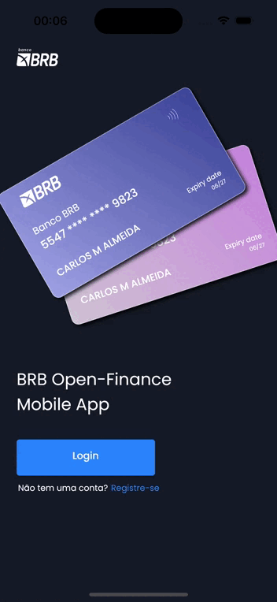

# WinX Banking

A aplicação WinX banking é um projeto mobile que visa utilizar o open finance para que se tenha um extrato de forma única de acordo com todas as contas bancárias do usuário. O projeto foi desenvolvido durante o Hackaton do BRB na Campus Party e suporta várias evoluções e ampliações de escopo.

## Como rodar

Aqui vão os passo para o rodar o projeto WinX Banking:

1- Inicialmente instale o flutter em sua máquina pelo [link](https://docs.flutter.dev/get-started/install?gclid=Cj0KCQjw_r6hBhDdARIsAMIDhV_VVFe5pFqpwGlWv8tuA6W4lJZ9fMg4H3_W263GkI_81rjB5RRW_N8aAnvVEALw_wcB&gclsrc=aw.ds), siga todos os passos de configuração.

2- Clone o repositório em seu computador e abra ele em um editor de códigos, podendo ser o Android Studio ou o VSCode.

3- Rode em seu terminal o comando:

```
flutter pub get
```

### Emulando em Android

Caso esteja utilizando um emulador Android, será necessário realizar uma alteração no arquivo /core/app_constants.dart. Utilizando um emulador Android é necessário que no lugar de 'localhost' você insira o código IP da sua máquina, como exemplo o arquivo ficará como da seguinte forma:

```
static const String BASE_URL = "http://192.143.5.70:3333/";

```

4- Após isso rode em seu terminal: 

```
flutter run
```

### Emulando em iOS

Para a utilização de emuladores iOS não é necessário alterar o arquivo!


4- Após isso rode em seu terminal: 

```
flutter run
```

## App Demo

<center>
                   
</center>
